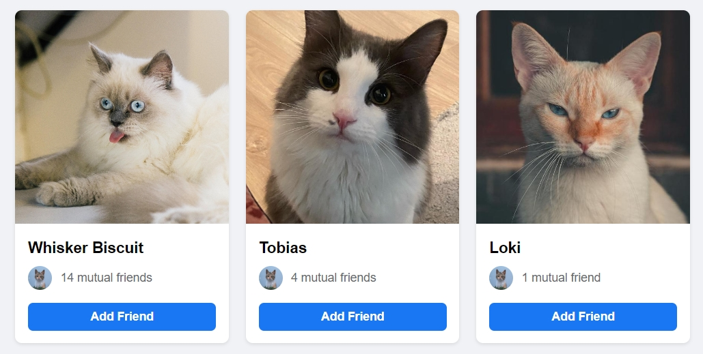
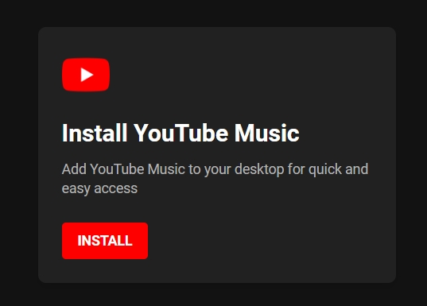
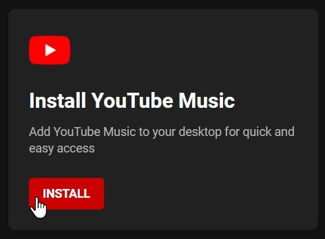
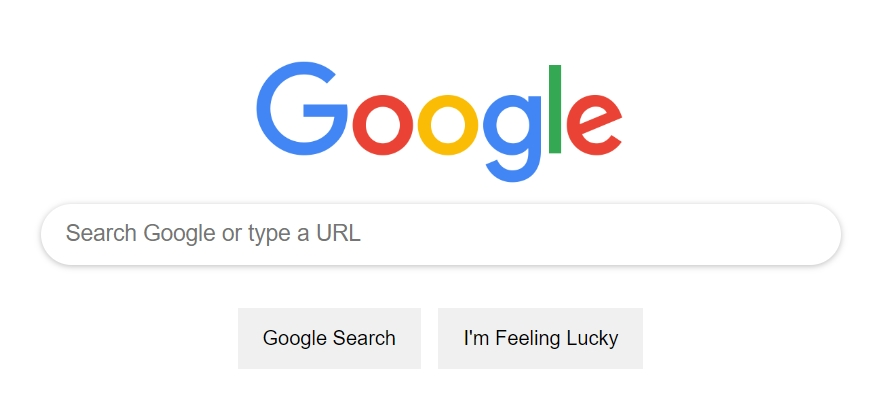
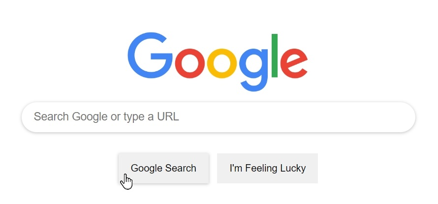
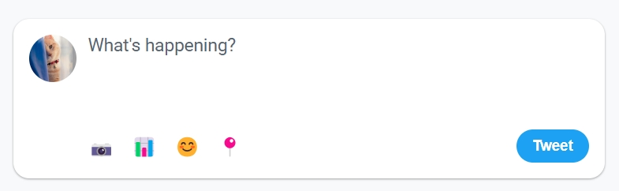
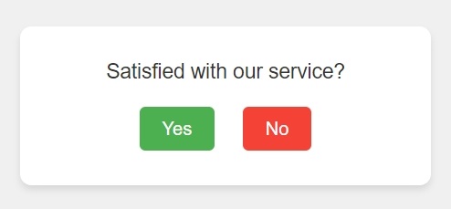

# Project Showcase

## 🎯 Friends Suggestions Interface: A Modern Social Connection Design

This project presents an intuitive and visually engaging interface for displaying friend suggestions.  
Developed with **HTML** and **CSS**, the layout is responsive and contemporary, effectively presenting potential connections to users.

<strong>📦 Project Structure</strong>

- The interface features a container that acts as a **central hub** for displaying suggested friend profiles.
- Each suggestion is represented by a **card-like structure**, including:
  - Profile picture
  - User name
  - Mutual friend information
  - A prominent **"Add Friend"** button for quick and easy connection initiation.

<strong>🎨 Styling Highlights</strong>

- A cohesive color scheme, modern typography, and balanced spacing create a **clean and user-friendly interface**.
- Profile cards feature **subtle shadows** and **rounded corners** for a polished appearance.

 

---

## 🎵 YouTube Music Installation Interface: A Sleek Desktop Integration Design

This project offers a focused interface for promoting YouTube Music desktop installation.  
Built with **HTML** and **CSS**, it delivers a clean and modern user experience.

<strong>📦 Project Structure</strong>

- A compact container serves as the **central promotional unit**.
- The layout includes:
  - YouTube Music logo
  - Bold title
  - Concise description of benefits
  - Clear **"Install"** button
- Everything is arranged for a **single, focused call-to-action**.

<strong>🎨 Styling Highlights</strong>

- Consistent use of **YouTube's brand colors**, modern typography, and thoughtful spacing.
- A **dark theme** enhances brand alignment and creates a familiar feel.

 
 

---

## 🔍 Google Search Interface: A Minimalist and Iconic Design

This project recreates the classic Google Search homepage using **HTML** and **CSS**, showcasing a minimal and functional layout.

<strong>📦 Project Structure</strong>

- Three core elements are centered on the page:
  - Google logo
  - Search input field
  - Action buttons: "Google Search" and "I'm Feeling Lucky"
- The layout ensures a **clear and intuitive search experience**.

<strong>🎨 Styling Highlights</strong>

- **Subtle shadows**, **rounded corners**, and **clean spacing** reinforce a familiar Google feel.
- **Hover effects** provide interactive feedback while maintaining simplicity.

 
 

---

## 🐦 Twitter Tweet Composer: A Sleek Social Media Interaction Design

This interface emulates the tweet composer on Twitter.  
Built with **HTML** and **CSS**, it offers a modern, streamlined tweeting experience.

<strong>📦 Project Structure</strong>

- Includes:
  - User avatar
  - Tweet composition textarea
  - Action icons row
  - "Tweet" button
- The design offers a **clean and complete toolset** for tweet creation.

<strong>🎨 Styling Highlights</strong>

- Embraces **Twitter's blue color palette**, with **rounded corners** and **responsive spacing**.
- Responsive design ensures optimal display across different devices.

 
 

---

## 💬 Customer Satisfaction Survey: A Concise Feedback Collection Design

A minimal, user-friendly interface for gathering feedback.  
Created with **HTML** and **CSS**, the design emphasizes quick responses and high usability.

<strong>📦 Project Structure</strong>

- Three main elements:
  - Question: *"Satisfied with our service?"*
  - Response buttons: **"Yes"** and **"No"**
  - Card container for visual clarity
- The layout provides a **quick and simple feedback path**.

<strong>🎨 Styling Highlights</strong>

- **Contrasting button colors**, **clean layout**, and **rounded cards** create a modern interface.
- Responsive and centered design enhances usability on all screen sizes.

 
